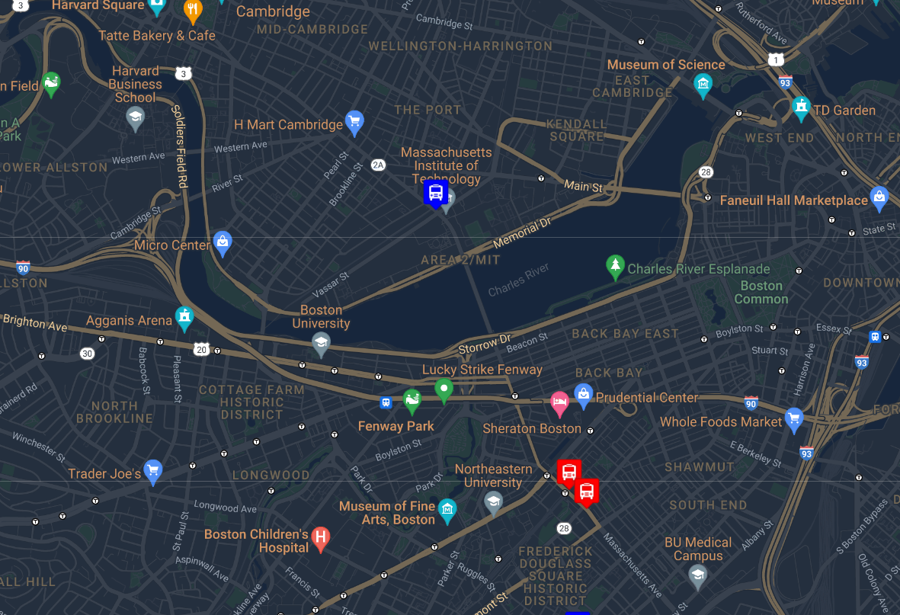

# Real Time Bus Tracker
## Exercise on Boston Bus Tracker

This map demonstrates a real-time animation that tracks and displays the live locations and movements of Boston buses on a map at 15 second intervals. I have used an API to source the real-time data of the Boston MBTA buses. I have used Google's night mode style for this live animated bus tracker.
  
To run this on your machine, you'll need all of these files and you'll need to load the .html file onto your browser (NOTE: API keys are currently not present in code. They are needed to run the code). 
  
Additional functionality that would be helpful to a user for future iterations would be to change the code for the style to automatically switch to day mode when it is daylight in Boston.

